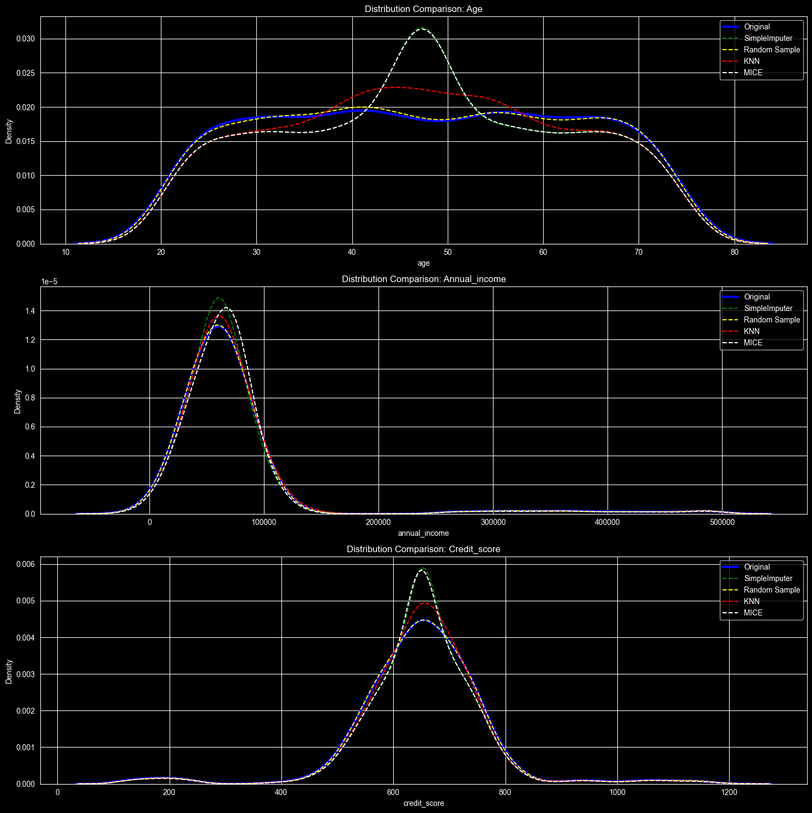
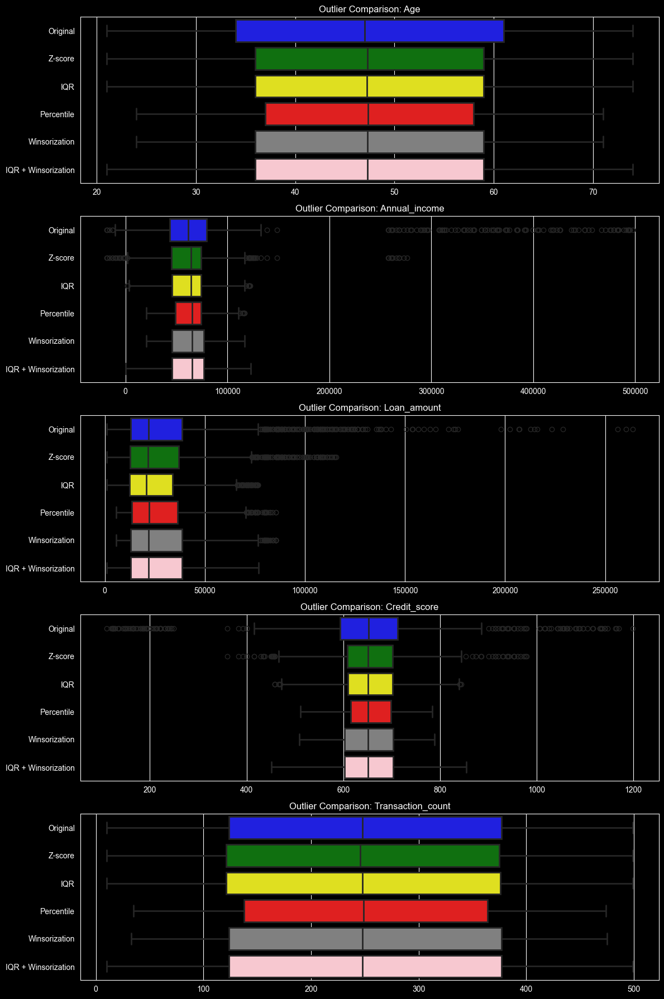

# <center>🧠 Holistic Data Preparer: Final_Project 

> A comprehensive, end-to-end implementation of data preprocessing and feature engineering for a **Credit Risk / Loan Default** classification problem — built from multi-source data across CSV, JSON, and SQL.


---

## 📌 Project Objective

In a real-world lending and credit ecosystem, raw customer data is scattered, messy, and rarely model-ready. This project simulates working as a **Junior Data Scientist at a financial services company**, where the goal is to:

- **Frame the ML problem**: Binary classification — predicting **loan default** (`default_flag`: 0 or 1)
- **Unify multi-source data**: Merge records from a CSV, a JSON file, and a SQLite database
- **Prepare the data end-to-end**: Clean, impute, encode, scale, engineer, and transform features
- **Deliver a model-ready dataset**: Export a fully preprocessed 29-feature dataset ready for ML pipelines

This project goes far beyond basic EDA — it is a systematic, production-oriented data preparation pipeline, covering **8 distinct stages** from raw ingestion to a final deliverable.

---

## 📂 Repository Structure

```
📦 Final_Project
 ┣ 📜 transactions_main.csv                        # Raw transactional data (loan + spending info)
 ┣ 📜 customer_metadata.json                       # Customer demographic data (2,500 records)
 ┣ 📜 financial_history.db                         # SQLite DB with credit scores & repayment history
 ┣ 📜 holistic_data_preparer.ipynb                 # Main Jupyter Notebook — full pipeline
 ┣ 📜 final_cleaned_data.csv                       # Final preprocessed dataset (2,500 × 29 features)
 ┣ 📜 customer_credit_risk_dataset_EDA_report.html # Interactive automated EDA report
 ┗ 📜 README.md                                    # This file
```

---

## 📊 Dataset Overview

The project merges **3 data sources** into a unified customer profile:

| Source | File | Records | Key Features |
|---|---|---|---|
| CSV | `transactions_main.csv` | 2,500 | `loan_amount`, `loan_purpose`, `transaction_count`, `spending_ratio`, `default_flag` |
| JSON | `customer_metadata.json` | 2,500 | `age`, `gender`, `region`, `education_level`, `employment_type`, `join_date` |
| SQL | `financial_history.db` | 2,500 | `annual_income`, `credit_score`, `repayment_history` |

**Target Variable**: `default_flag` — Binary (0 = No Default, 1 = Default)

**Final Merged Dataset Shape**: `2500 rows × 29 columns`

---

## 🛠️ Key Features & Workflow

The notebook (`holistic_data_preparer.ipynb`) is structured across **8 progressive parts**:

---

### Part A — Conceptual Foundation 📚

- Short notes on Data Analysis, ML problem types, and tensor fundamentals
- Demonstrates scalar (0D), vector (1D), matrix (2D), and higher-dimensional tensors using NumPy
- Sets the theoretical context for the data science workflow ahead

---

### Part B — Multi-Source Data Acquisition 🌐

- Loaded `transactions_main.csv` via `pandas.read_csv()`
- Loaded `customer_metadata.json` via `pandas.read_json()` (2,500 customer records)
- Connected to `financial_history.db` via `sqlite3` and extracted the `repayment_records` table using `pd.read_sql()`
- Merged all three sources on `customer_id` into a single unified DataFrame

---

### Part C — Data Understanding & Cleaning 🧹

- Reordered columns logically (demographics → financial → target)
- Inspected schema with `.info()` and `.describe()`
- Identified and quantified null values with `.isnull().sum()`
- Generated an automated HTML profiling report using `ydata-profiling`'s `ProfileReport`
- Applied and **compared 4 imputation strategies** on missing values:

| Strategy | Method | Best For |
|---|---|---|
| Simple Imputer | Mean / Median / Mode | Quick baseline |
| Random Sample | Random value from non-null pool | Preserving distribution |
| KNN Imputer | K-nearest neighbours | Correlated features |
| **MICE** | **Iterative / IterativeImputer** | **Best results — selected** |

> ✅ **MICE (Multiple Imputation by Chained Equations)** was selected as the final imputation strategy after comparing KDE distribution plots for `age`, `annual_income`, and `credit_score`.

---

### Part D — Outlier Handling 📐

Applied and compared **4 outlier treatment methods** on numerical columns (`age`, `annual_income`, `loan_amount`, `credit_score`, `transaction_count`):

| Method | Approach | Records Lost |
|---|---|---|
| Z-Score | Remove rows beyond ±3σ | Variable |
| IQR | Remove rows outside [Q1−1.5×IQR, Q3+1.5×IQR] | Variable |
| Percentile Clipping | Remove below 5th / above 95th percentile | Variable |
| **IQR + Winsorization** | **Cap to IQR bounds (no rows deleted)** | **Zero ✅** |

> ✅ **IQR + Winsorization** was chosen as it retains all 2,500 records while correcting extreme values — essential for credit risk data where boundary cases matter.

---

### Part E — Feature Engineering ⚙️

**Categorical Encoding** — explored and applied multiple strategies:

| Technique | Applied To | Notes |
|---|---|---|
| Ordinal Encoder | `education_level` | Preserves natural order: Primary → Post-Graduate |
| Label Encoder | All categoricals | Demonstrated for reference only (not used in final data) |
| One-Hot Encoder | `region`, `loan_purpose`, `gender`, `employment_type` | `drop='first'` to avoid multicollinearity |

**Numerical Encoding / Binning**:

- **KBinsDiscretizer (uniform)**: Binned `annual_income` and `repayment_history` into 4 equal-width intervals
- **Binarizer**: Created `credit_score_gt_700` — a binary flag for prime vs. subprime credit
- **Quantile Binning**: Binned `transaction_count` into equal-frequency quartiles
- **K-Means Binning**: Binned `transaction_count` using K-Means cluster boundaries

---

### Part F — Feature Scaling 📏

Demonstrated and compared **5 scaling techniques** on numerical features:

| Scaler | Formula | Best When |
|---|---|---|
| StandardScaler | (x − μ) / σ | Data is approximately normal |
| Normalizer L1 | x / Σ\|x\| | Sparse data or text vectors |
| Normalizer L2 | x / √(Σx²) | Neural networks, distance metrics |
| MinMaxScaler | (x − min) / (max − min) | Bounded range needed [0, 1] |
| MaxAbsScaler | x / max(\|x\|) | Sparse data, no centering |
| **RobustScaler** | **(x − median) / IQR** | **Presence of outliers ✅** |

---

### Part G — Feature Construction & Transformation 🔨

**Constructed 3 new domain-relevant features**:

| New Feature | Formula | Rationale |
|---|---|---|
| `debt_to_income_ratio` | `loan_amount / annual_income` | Core credit risk metric |
| `average_monthly_transactions` | `transaction_count / months_since_join` | Activity normalized by tenure |
| `spending_to_income_ratio` | `spending_ratio × loan_amount / annual_income` | Affordability indicator |

**Applied 5 mathematical transformations** to address skewness in `spending_ratio`, `loan_amount`, and `annual_income`:

- Log Transform (`np.log1p`)
- Reciprocal Transform (`1 / (x + 1)`)
- Square Root Transform (`np.sqrt`)
- Box-Cox Transform (requires strictly positive values)
- Yeo-Johnson Transform (handles zero and negative values)

---

### Part H — Final Deliverable 📦

- Exported the final preprocessed dataset to `final_cleaned_data.csv`
- Final shape: **2,500 rows × 29 columns**
- Zero missing values, zero data leakage, fully model-ready

**Final feature set includes**:

```
customer_id, default_flag, join_date, age, gender, region, education_level,
employment_type, annual_income, loan_amount, loan_purpose, credit_score,
repayment_history, transaction_count, spending_ratio, education_level_enc,
region_North, region_South, region_West, loan_purpose_Car, loan_purpose_Education,
loan_purpose_Home, gender_Male, gender_Other, employment_type_Self-Employed,
employment_type_Unemployed, debt_to_income_ratio, average_monthly_transactions,
spending_to_income_ratio
```

---

## 📸 Screenshots & Visuals

> _The notebook contains inline visualizations for each stage. Key plots include:_

### KDE Comparison — Imputation Methods
> Side-by-side KDE plots comparing the distribution of `age`, `annual_income`, and `credit_score` before and after each imputation strategy, confirming MICE best preserves the original distribution.




### Outlier Treatment Comparison
> Box plots comparing `age`, `annual_income`, `loan_amount`, `credit_score`, and `transaction_count` across all 4 outlier handling methods.




### Automated Profiling Report
> An interactive HTML report (`customer_credit_risk_dataset_EDA_report.html`) generated via `ydata-profiling` covering:
> - Descriptive statistics per variable
> - Missing value heatmaps
> - Correlation matrices
> - Data quality warnings (high cardinality, skewness, zeros)

The report is included in the repository. Open it directly in any browser — no server or installation required:

```bash
# From the project directory
open customer_credit_risk_dataset_EDA_report.html       # macOS
start customer_credit_risk_dataset_EDA_report.html      # Windows
xdg-open customer_credit_risk_dataset_EDA_report.html   # Linux
```

---

## ⚙️ Getting Started

### 1. Clone the Repository

```bash
git clone https://github.com/<your-username>/holistic-data-preparer.git
cd holistic-data-preparer/Final_project
```

### 2. Install Dependencies

```bash
pip install pandas numpy matplotlib seaborn scikit-learn ydata-profiling jupyter
```

### 3. Launch the Notebook

```bash
jupyter notebook
```

Open `holistic_data_preparer.ipynb` and run all cells top to bottom. The final cleaned dataset and HTML report will be generated automatically.

---

## 🧰 Tech Stack

| Tool | Purpose |
|---|---|
| `Python 3.10+` | Core language |
| `pandas` | Data loading, merging, and manipulation |
| `numpy` | Numerical operations and transformations |
| `sqlite3` | SQL database connection |
| `scikit-learn` | Imputation, encoding, scaling, binning |
| `matplotlib` + `seaborn` | Visualizations |
| `ydata-profiling` | Automated HTML EDA report |
| `Jupyter Notebook` | Interactive development environment |

---

## 📈 Results & Output

| Deliverable | Description |
|---|---|
| `final_cleaned_data.csv` | 2,500 × 29 model-ready feature matrix, zero nulls |
| `customer_credit_risk_dataset_EDA_report.html` | Interactive profiling report |
| Inline visualizations | KDE plots, box plots, encoding comparisons in the notebook |

---

## 🗺️ ML Problem Definition

| Attribute | Detail |
|---|---|
| **Task Type** | Supervised Binary Classification |
| **Target Variable** | `default_flag` (0 = Repaid, 1 = Defaulted) |
| **Feature Count** | 28 features (after dropping `customer_id`) |
| **Dataset Size** | 2,500 records |
| **Suggested Models** | Logistic Regression, Random Forest, XGBoost, LightGBM |

---

## 👨‍💻 Author

**Krish Desai**
GitHub: [@krish-desai-123](https://github.com/krish-desai-123)

---

> If this repository helped you learn something new or saved you time, consider giving it a ⭐ — it means a lot!
